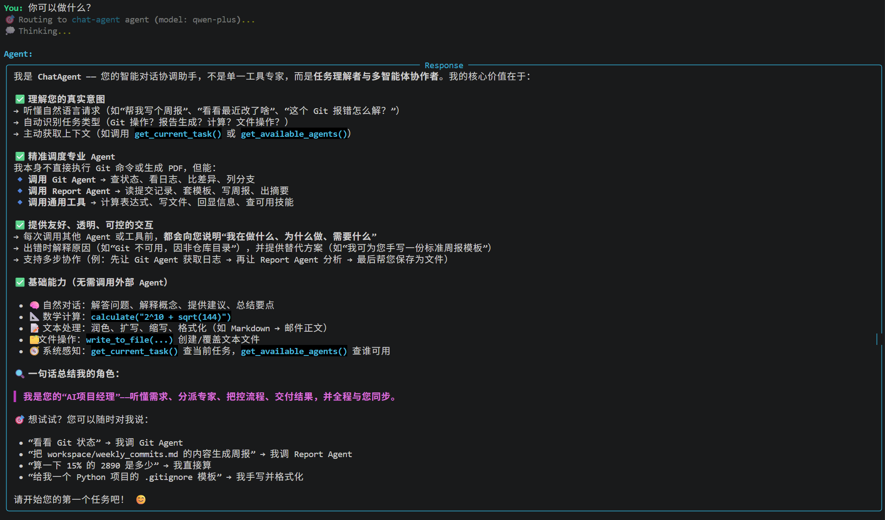
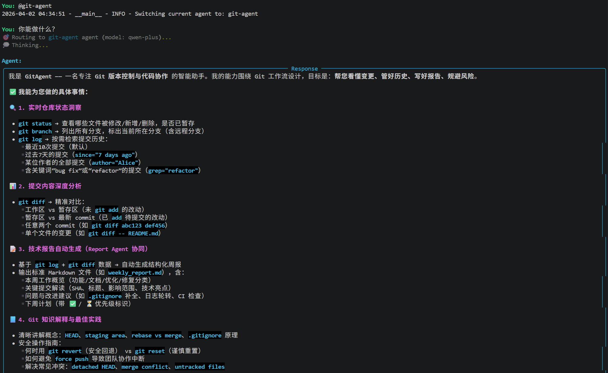
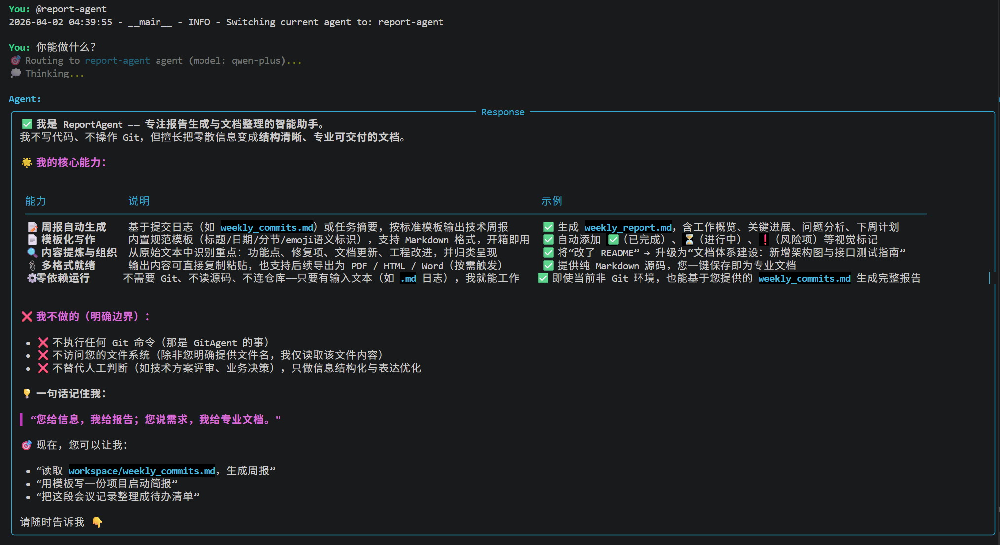
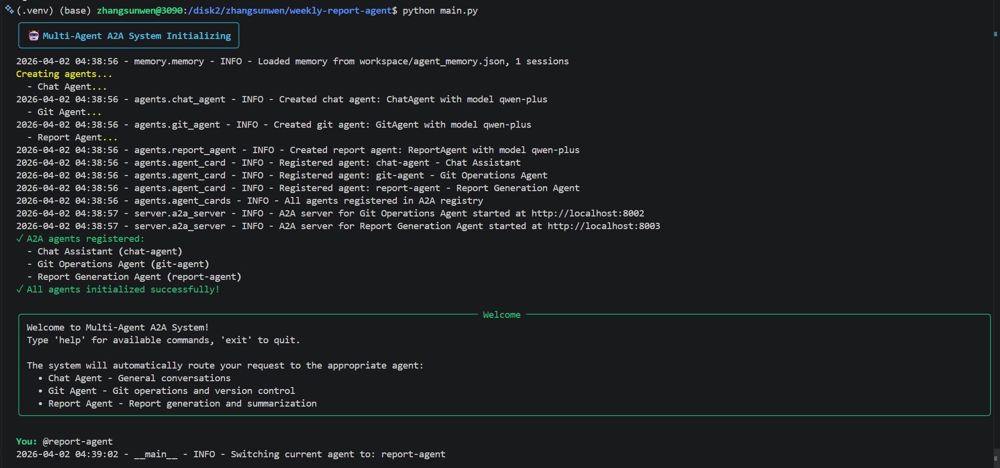

# Weekly Report Agent

这是一个基于多智能体架构的周报生成系统，能够自动分析 Git 提交记录并生成结构化技术周报。系统采用模块化设计，包含多个专业智能体，支持交互式对话和自动化任务处理。

## 🧠 系统架构

系统核心组件：
- **Chat Agent** - 主交互代理，处理自然语言对话并协调其他代理

- **Git Agent** - Git 操作代理，用于获取提交历史和代码差异


- **Report Agent** - 报告生成代理，根据模板生成结构化报告


## 📦 项目结构

```
weekly-report-agent/
├── agents/            # 智能体模块
│   ├── chat_agent.py  # 聊天代理
│   ├── git_agent.py   # Git 操作代理
│   └── report_agent.py# 报告生成代理
├── tools/             # 工具模块
│   ├── git_tool.py    # Git 操作工具
│   ├── chat_tool.py   # 聊天相关工具
│   └── report_tool.py # 报告生成工具
├── workspace/         # 工作空间
│   ├── agent_memory.json # agent记忆
│   ├── task.md # 任务提示词
│   ├── report_template.md # 报告模板
│   └── weekly_report.md   # 生成的周报
├── main.py            # 主程序入口
└── requirements.txt   # 依赖包列表
```

## 🛠️ 功能特性

1. **Git 分析**：自动分析指定仓库的提交历史，提取代码变更信息
2. **智能解析**：分析代码差异，识别新增功能、修改内容、修复问题和重构部分
3. **报告生成**：根据预定义模板生成结构化技术周报
4. **交互界面**：支持命令行交互，提供友好的用户界面
5. **多代理协作**：不同专业代理协同工作，完成复杂任务

## 📝 使用说明

1. 安装依赖：`pip install -r requirements.txt`
2. 配置环境变量：在 `.env` 文件中设置 API 密钥等参数
3. 运行系统：`python main.py`

4. 使用交互模式：
   - 输入 `help` 查看可用命令
   - 输入 `@git-agent` 切换到 Git 代理模式
   - 输入 `@report-agent` 切换到报告生成代理模式
   - 输入 `clear` 清除屏幕
   - 输入 `exit` 退出系统
5. 启动周报生成任务
   - 指定任务提示词 workspace/task.md
   - 指定周报模板 workspace/report-template.md
   - 通过指令@chat-agent切换代理为 chat-agent
   - 通过提示词，如"请获取当前任务并执行"启动任务， chat-agent会和git-agent、report-agent进行通信以完成任务


## 🧪 示例工作流

1. 获取 Git 提交历史：`使用git工具，查看最近7天的提交以及代码差异`
2. 分析提交内容：系统会自动解析代码变更，识别新增功能、修改内容等
3. 生成技术周报：`请调用工具获取报告模板并读取提交分析记录，生成一份完整的技术周报`
4. 查看生成的报告：`cat workspace/weekly_report.md`

## Agent单独使用示例


## 📎 技术要点

- 使用 LangChain 和 LangGraph 构建智能体框架
- 采用 InMemorySaver 实现对话状态持久化
- 通过 Rich 库提供美观的命令行界面
- 支持多种 LLM 模型（通过 llm_factory 模块）
- 提供工具回调机制，可视化工具调用过程

## 📚 依赖库

主要依赖：
- langchain
- langgraph
- rich
- python-dotenv
- gitpython
- pytz
- math
- subprocess

## 📌 注意事项

1. 确保 Git 仓库路径正确配置
2. 需要有效的 API 密钥（如 DashScope 或 OpenAI）
3. 工作空间文件会自动保存在 workspace 目录下
4. 系统日志记录在 logs/app.log 文件中
5. 可通过 `.env` 文件调整系统配置

## 📬 联系方式

如有问题，请留言
